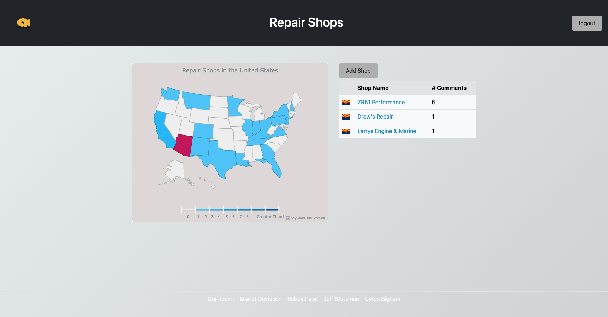
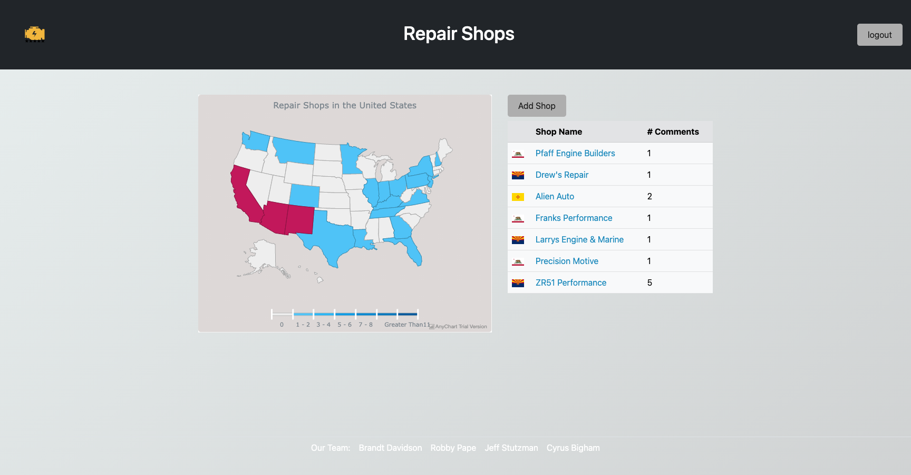
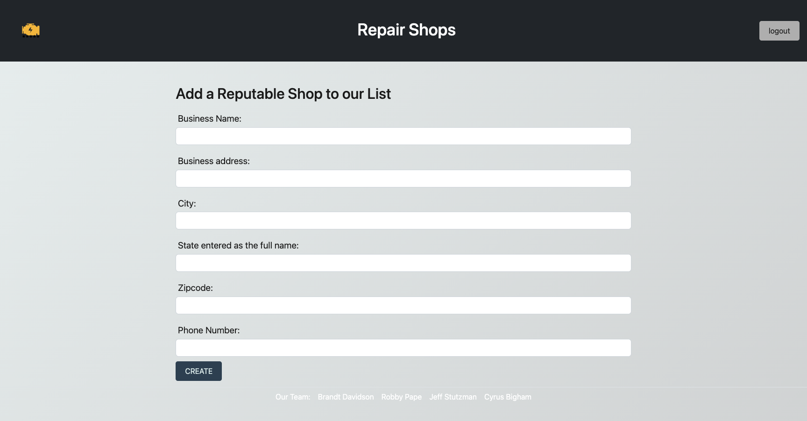
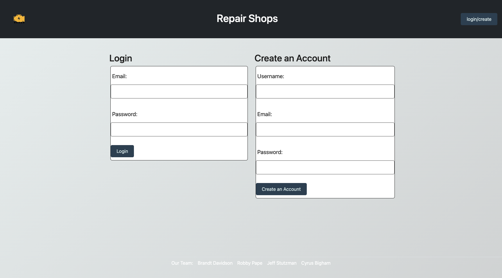
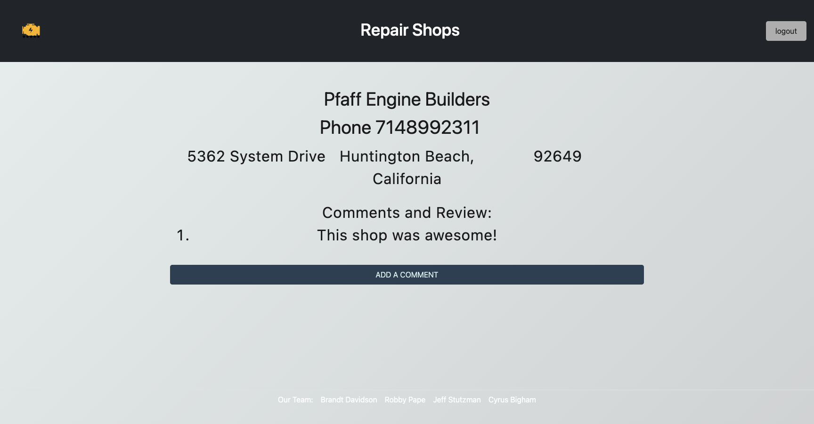

# Project 2: ZR-1-Stop Shops

## Description

#### ZR1-STOP SHOPS

The Corvette ZR1 was produced from 1990-1995 with only 6935 examples created with its unique engine. The LT5 was designed by Lotus and doesn’t share any Chevrolet engine components, making it quite difficult to find a shop that is knowledgeable. ZR1 owners current resource is a ZR1 Registry Forum thread which contains a list which was inadequate at best, as they all had partial information.
Where do I even begin? When I have a check engine light and don’t know where to start, I want a lookup tool to find reputable ZR1 repair shops and comments pertaining to those shops in or near my state.

## Criteria

* Upon navigating to this page, I am prompted with a map of the United States.  
- From that map, I have the ability to click on any state to get a list of reputable shops in that state and the corresponding number of comments for that shop.  
- I will also be able to click on each shop and a new page will display this shop, their phone number, address, city, state, zip and comments.
#### For additional features:
- I must login as a user, therefor; I must create an account. When I click on Create, I am taken to a form to input a unique username, email and password.
* Once I have created my user, I can then login to the site. As a logged in user:
- I have access to add a shop to the list of shops. By clicking the Add Shop button i am taken to a form where i can input the required information to add a shop.
  Once added, this shop will then appear as a new shop on the list of shops within its corresponding state.
  Also as a logged in user, I will also be able to add a comment to a shop. When in the shop view, i can click the Add Comment button, and I will be taken to a form where i can input a comment for that shop.
  This comment can then be seen from that shops’ page.

## Screenshots

## Live Deployed Link

[Github Repo for Project-2](https://github.com/RPAPE3/Project-2)

[Live Heroku Deployed Link](https://whispering-basin-00391.herokuapp.com/)

## Credits

[Robby Pape](https://github.com/RPAPE3)

[Brandt Davidson](https://github.com/BrandtDavidson)

[Jeff Stutzman](https://github.com/jstoozy23)

[Cyrus Bigham](https://github.com/bighamcyrus)